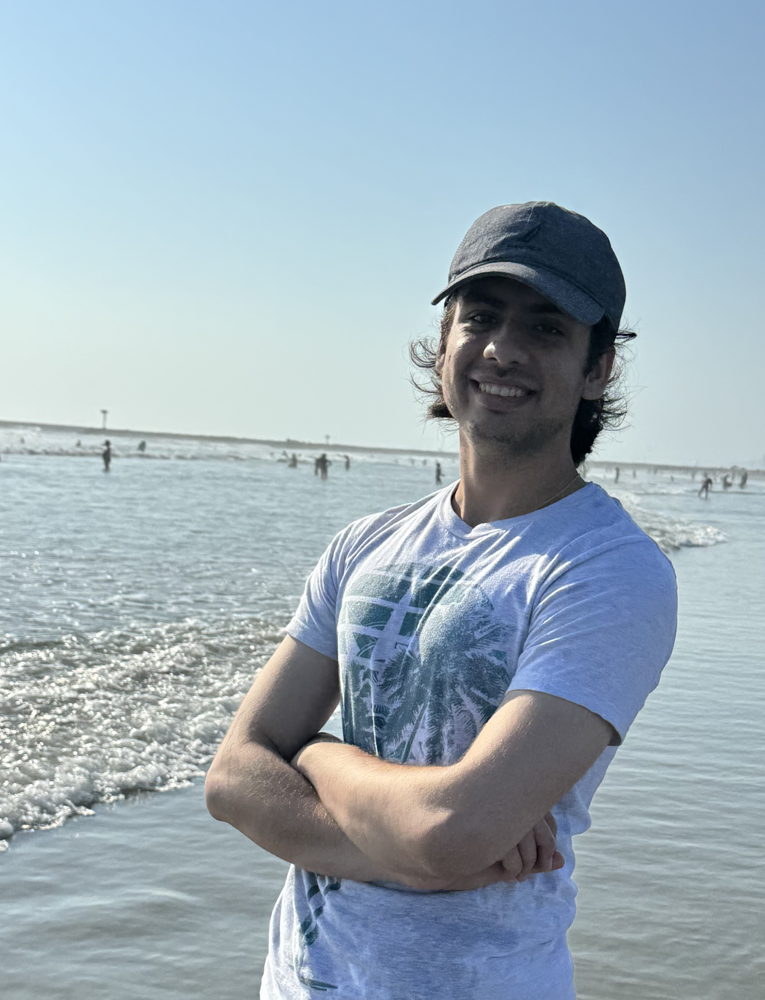

# Aryan's About Page


## Table of contents
- [Aryan's About Page](#aryans-about-page)
  - [Table of contents](#table-of-contents)
  - [Task List](#task-list)
  - [About me](#about-me)
  - [An image of me on the beach!](#an-image-of-me-on-the-beach)
  - [Codes and Quote](#codes-and-quote)


## Task List
Don't mind me, just keeping track of this page
- [x] Table of contents
- [ ] About me -- Needs some work
- [x] An imageof me 
- [x] Add my favorite quote maybe?
- [ ] Possible scaling of this page?


## About me
I'm a first year **CS transfer** student here at UCSD! I finished the first two years of my college career at San Diego Miramar College. I also live pretty close by, so I commute to campus.


## An image of me on the beach!


Here's my 

Here are some things that I *love*:
1. Origami -- I love making different things with paper, and have been doing it for some 11 years at this point
   * In case you're wandering, here's my [favorite channel](https://www.youtube.com/@MarianoZavalaOrigami) for this stuff!
2. Beach -- Whenever going out, this is the one place I love going to because there's an endless amount of things you can do there:
   * Volleyball
   * Picnics
   * A fun hangout with friends
   * Or just sitting and enjoying the sunsets
3. I also love just going out of the house and trying new things, especially new cafes!


## Codes and Quote
Here's a quote and a piece of code that I try to live by:
> Sometimes, the bad things that happen in our lives put us directly on the path to the best things that will ever happen to us. - *Nicole Reed*

```
if <coffee.empty> {
    coffee.refill();
} 
else {
    coffee.drink();
}
```


Lastly, if you want to find out more, here's a link to the [about-me repository readme file](/README.md)!